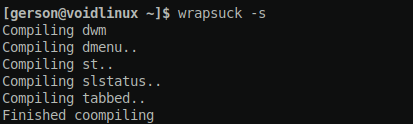

# wrapsuck
> A tiny wrapper script to compile suckless software

## Dependencies :
- ``make`` to compile with the Makefile
- ``doas`` as root command

## Usage :
``./wrapsuck -s`` to compile your suckless softwares ( dwm, dmenu, st, slstatus, tabbed ). It'll will ask for your password everytime you do make.
